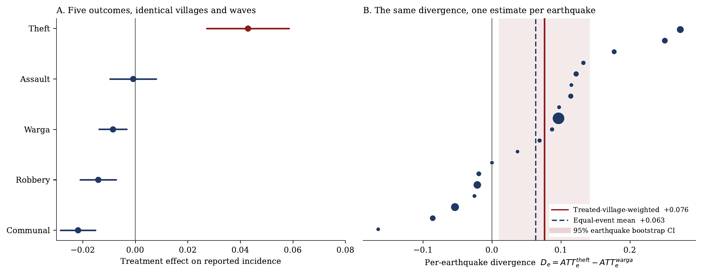
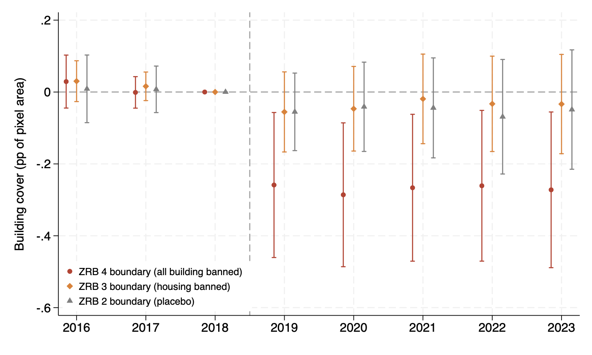

## Research interests

**Primary fields**

:::: {.grid-2}

::: {.area}

### Development Economics
Shocks, informal insurance, and household responses where formal insurance and
state capacity are weak.

:::

::: {.area}

### Public Economics
How public money is actually spent. Government procurement, the efficiency of
public purchasing, and the distance between what a rule requires and what an
official can do.

:::

::::

**Secondary fields**

:::: {.grid-2}

::: {.area}

### Political Economy
Local order, collective action, and the institutions that govern public
resources, including public procurement.

:::

::: {.area}

### Industrial Organization
Competition and bidding in government procurement markets, contract design, and
what determines whether a tender delivers value rather than only a low price.

:::

::::

::: {.area .methods}

### Methods
Causal inference on long administrative panels, and the measurement problems
that come with changing administrative boundaries.

:::

::: {.tags}

[Difference-in-Differences]{} [Instrumental Variables]{}
[Regression Discontinuity Design]{} [Spatial Econometrics]{}
[Geospatial Data Analysis]{} [Satellite & Remote Sensing Data]{}
[Administrative & Survey Microdata]{}

:::

::: {.figure}

[{fig-alt="Map of Indonesia. Villages first exposed to damage-level shaking are coloured by survey wave and scattered across the archipelago; stars mark the epicentre of the main earthquake behind each cohort."}](assets/img/fig_map_treated.png)

::: {.figcaption}

Damage-level earthquake exposure is staggered across two decades and scattered
across the archipelago, not concentrated in a single disaster. Villages are
coloured by the survey wave in which they were first exposed to MMI ≥ VI; stars
mark the epicentre of the main earthquake behind each cohort.

:::

:::

## Working papers

:::: {.paper}

::: {.paper-title}

Earthquakes and Communal Conflict: Evidence from Indonesia's Seismic Zones

:::

::: {.paper-meta}

with M. Halley Yudhistira and Jahen F. Rezki &nbsp;·&nbsp; [Working paper]{.paper-status} &nbsp;·&nbsp; JEL: D74, K42, Q54, O12, O18, R12

:::

::: {.paper-abstract}

Does a strong earthquake raise communal conflict or suppress it? The empirical
record disagrees even on the sign. We combine seven waves of Indonesia's village
census (PODES, 2005–2024) with USGS ShakeMap ground-shaking intensities for the
43,351 villages in the country's official medium and high seismic-hazard zones,
dating each village's first exposure to Modified Mercalli Intensity VI or above,
where ordinary masonry buildings begin to crack. First exposure lowers the
probability that a village reports a mass brawl by 1.73 percentage points against a
6.7 percent pre-exposure mean, a decline of 26 percent.

A fall in reported violence is not self-interpreting. It is equally consistent with
less fighting, with a village head too busy to file a report, and with a general
improvement in local order under the eye of arriving responders. No single outcome
separates those readings, and the disaster-conflict literature has been asking the
question with one outcome at a time. The same form, filed by the same village head
over the same twelve-month recall window, also records theft, robbery, and assault,
and those acts differ in what they demand of whoever commits them: communal violence
needs coordination and confrontation together, robbery an encounter but no
coordination, theft neither. Holding reporter, instrument, and window fixed turns
that variation into an identification device.

On a single common sample of 300,018 village-waves, communal conflict falls by 1.7
percentage points against a 2.6 percent base while theft does not follow it down.
Equality of the two responses is rejected on both scales (p = 0.003 linear, p < 0.001
proportional), and robbery and assault do not follow theft. Taken to the earthquake,
the unit at which treatment is actually assigned, the divergence is 7.6 percentage
points weighting shocks by the villages they treat and 6.3 points counting each shock
once (p = 0.023), positive in 12 of the 19 usable earthquakes.

We are deliberate about which half of that contrast carries the weight. It is the
communal decline, not theft's level. Theft rises sharply under wave effects, but its
own coefficient is not separately identified once province-by-wave effects are
imposed, and nothing in the argument requires theft to have risen. What the data
establish is that the two series part company, and that they part company because
collective violence falls while acquisitive crime does not.

That pattern discriminates. A uniform reporting shock moves all four acts together, a
general collapse of local order raises all four, and a rise in the motive for
predation raises theft and robbery together. What we observe is most consistent with a
loss of the organisational capacity that collective violence requires and stealth
theft does not. A pre-determined moderator points the same way: the decline
concentrates in villages that had mobile-phone signal at the 2005 baseline, an
interaction worth 2.1 percentage points. High-involvement public-purpose *gotong
royong* falls by 3.1 to 3.2 percentage points after exposure, while emergency mutual
aid, which needs no standing coordination, does not.

:::

::: {.figure style="margin-top:1.2rem"}

[{fig-alt="Two panels. Panel A, a coefficient plot on five outcomes: theft sits above zero, communal conflict, robbery and warga sit below it, assault sits on it. Panel B, a scatter of the theft-minus-warga divergence for each of nineteen earthquakes, most of them positive, with both pooled means and the bootstrap band above zero."}](assets/img/fig_composition.png)

::: {.figcaption}

The composition of disorder. Panel A plots the treatment effect on each of five
outcomes, estimated on the single common sample of 300,018 village-waves with village
and wave fixed effects and 95 percent village-clustered intervals. Communal conflict,
robbery, and the civilian-versus-civilian *warga* series sit below zero, theft sits
above it, and assault sits on it. *Warga* is the subtype whose survey wording is
near-stable across all seven waves. Panel B re-estimates the theft-minus-*warga*
divergence separately for each of the 19 usable earthquakes, sorted by magnitude, with
marker area proportional to the villages a shock treats. The divergence holds when the
earthquake, rather than the village, is the unit of inference.

:::

:::

::: {.paper-links}

[Draft (PDF)](files/paper1-earthquakes-communal-conflict.pdf) [Supplementary material (PDF)](files/paper1-supplementary-material.pdf) [This version: .]{.disabled}

:::

::::

## Work in progress

:::: {.paper}

::: {.paper-title}

Faith after the Shock: Earthquakes, Religious Expenditure, and the Insurance
Value of Religion in Indonesia

:::

::: {.paper-meta}

Billy Tulungen &nbsp;·&nbsp; [In progress]{.paper-status}

:::

::: {.paper-abstract}

Does religion function as informal insurance against uninsured risk? The
existing evidence rests largely on stated religiosity measured at district level
or on aggregate shocks. This project instead observes what households actually
pay: religious and ceremonial expenditure in rupiah, drawn from the consumption
module used for Indonesia's official poverty statistics, matched to
village-level earthquake exposure on constant 2005 boundaries. The design
separates three channels with opposing predictions — the income effect, the
club-good or mutual-insurance channel, and the coping channel — using a
within-block placebo that isolates the income effect and a continuous exposure
measure built from exact event timestamps against the survey's twelve-month
recall window.

:::

::::

:::: {.paper}

::: {.paper-title}

Lines Drawn after the Ground Moved: Post-Disaster No-Build Zones and
Reconstruction in Palu, Indonesia

:::

::: {.paper-meta}

Billy Tulungen &nbsp;·&nbsp; [In progress]{.paper-status} &nbsp;·&nbsp; JEL: Q54, R14, R52, O18

:::

::: {.paper-abstract}

Can a government keep people out of places a disaster has shown to be unsafe?
After the 2018 Palu earthquake, liquefaction, and tsunami, Indonesia announced
zones where all rebuilding was banned and a surrounding tier where housing was
banned. I digitize the official zone map, build a grid of 75-metre pixels over
197 villages, and measure buildings in every pixel and year from 2016 to 2023
with Google's Open Buildings 2.5D Temporal predictions. A
difference-in-discontinuities design compares pixels on either side of more
than 800 boundary segments, following the boundary design of Harari and Wong's
work on Jakarta's slum upgrading.

Building cover fell about 12 percent more inside the total-ban boundary, but
the whole gap opened in 2019, the year of the destruction, and never widened.
After the disaster, construction grew at the same rate on both sides of every
announced boundary, including after the city adopted its spatial plan in 2021,
and destroyed structures were rebuilt on neither side. Night lights show the
destroyed flow sites going dark and staying dark. The legal zoning of 2021 and
2023 restricted a small fraction of the announced area, and its texts name the
main liquefaction sites among the protected zones. In Palu, policy followed the
destruction rather than causing the retreat.

:::

::: {.figure style="margin-top:1.2rem"}

[{fig-alt="Event-study plot, 2016 to 2023. Coefficients for three zone boundaries are flat and near zero before 2018. After the 2018 earthquake the total-ban boundary drops to about minus 0.27 and stays there through 2023, while the housing-ban and placebo boundaries stay near zero."}](assets/img/fig_zrb_eventstudy.png)

::: {.figcaption}

Building cover inside each zone boundary relative to just outside, by year, with
pixel and segment-by-year fixed effects and 95 percent intervals clustered by
boundary segment. The total-ban gap opens in 2019 and does not widen afterwards:
the destruction set the gap, and post-disaster construction grew at the same
rate on both sides.

:::

:::

::::

## Publications

:::: {.paper}

::: {.paper-title}

Kompetisi dan Efisiensi pada Pengadaan Pemerintah: Bukti Empiris pada
Kementerian/Lembaga di Indonesia

:::

::: {.paper-meta}

with Vid Adrison &nbsp;·&nbsp; *Indonesian Treasury Review*, 6(1), 19–29, 2021

:::

::: {.paper-abstract}

Does competition make government procurement cheaper? Using more than 82,000
procurement records from Indonesian line ministries and agencies, we find that
each additional bidder lowers the winning bid by about 3.35 percent of the
official cost estimate.

:::

::: {.paper-links}

[Article](https://doi.org/10.33105/itrev.v6i1.225)

:::

::::

## Grants

::::: {.entry}

::: {.years}

2026–2027

:::

:::: {.what}

[PhD Research Grant, ReCIPE Programme]{.role}

::: {.org}

"Crack Beneath and Between: Earthquakes and Communal Conflict in Indonesia's
Seismic Zone." Centre for Economic Policy Research (CEPR) and the UK Foreign,
Commonwealth and Development Office (FCDO).

:::

::::

:::::

## Dissertation

**Shaking Land and Shaking Lives: Essays on the Economic Impacts of Seismic
Disasters**. Department of Economics, Faculty of Economics and Business,
Universitas Indonesia. Expected completion February 2028. Supervisor:
M. Halley Yudhistira, Ph.D. Co-supervisor: Jahen F. Rezki, Ph.D.

The dissertation asks how large, plausibly exogenous physical shocks propagate
through village-level social and economic life in a setting where formal
insurance is thin and local order is largely self-enforced. The first two
chapters share a common empirical infrastructure: a long village panel
harmonised onto constant 2005 boundaries, and earthquake exposure constructed
from USGS ShakeMap intensity surfaces. The third turns from the shock to the
policy response, using satellite building data to study the no-build zones drawn
after the 2018 Palu disaster.

::::: {.entry}

::: {.years}

Chapter 1

:::

:::: {.what}

[Earthquakes and Communal Conflict]{.role}

::: {.org}

Village-level evidence from Indonesia, with M. Halley Yudhistira and Jahen F.
Rezki. Draft complete, under revision.

:::

::::

:::::

::::: {.entry}

::: {.years}

Chapter 2

:::

:::: {.what}

[Faith after the Shock]{.role}

::: {.org}

Earthquakes, religious expenditure, and the insurance value of religion. In progress.

:::

::::

:::::

::::: {.entry}

::: {.years}

Chapter 3

:::

:::: {.what}

[Lines Drawn after the Ground Moved]{.role}

::: {.org}

Post-disaster no-build zones and reconstruction in Palu, Indonesia. First full
draft, in progress.

:::

::::

:::::

## Data and code

I am committed to reproducible empirical work. Replication packages for the
dissertation chapters will be posted here as each paper is released: cleaning
code, analysis do-files, and the village boundary crosswalk used to harmonise
PODES waves onto constant 2005 boundaries.
