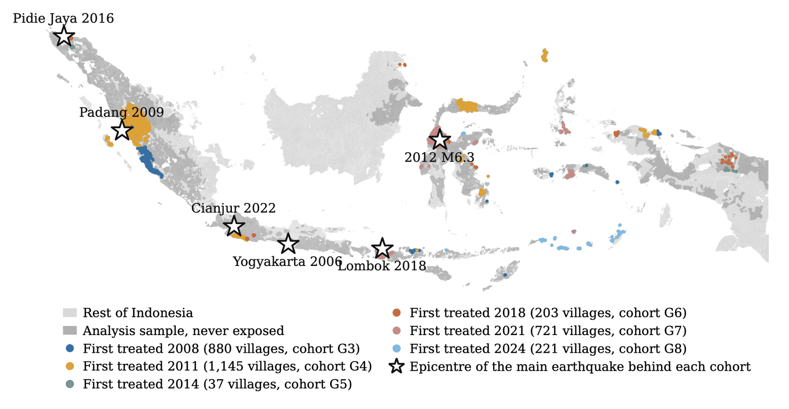

## Research interests

:::: {.grid-2}

::: {.area}

### Development Economics
Shocks, informal insurance, and household responses where formal insurance and
state capacity are weak.

:::

::: {.area}

### Urban & Regional Economics
Spatial distribution of economic activity, local public goods, and regional
disparities in Indonesia.

:::

::: {.area}

### Political Economy
Local order, collective action, and the institutions that govern public
resources, including public procurement.

:::

::::

::: {.area .methods}

### Methods
Causal inference on long administrative panels, and the measurement problems
that come with changing administrative boundaries.

:::

::: {.tags}

[Difference-in-Differences]{} [Spatial Econometrics]{}
[Geospatial Data Analysis]{} [Administrative & Survey Microdata]{}

:::

::: {.figure}

{fig-alt="Map of Indonesia. Villages first exposed to damage-level shaking are coloured by survey wave and scattered across the archipelago; stars mark the epicentre of the main earthquake behind each cohort."}

::: {.figcaption}

Damage-level earthquake exposure is staggered across two decades and scattered
across the archipelago, not concentrated in a single disaster. Villages are
coloured by the survey wave in which they were first exposed to MMI ≥ VI; stars
mark the epicentre of the main earthquake behind each cohort.

:::

:::

## Working papers

:::: {.paper}

::: {.paper-title}

Motive Without Mobilization? Earthquakes and Communal Conflict in Indonesia

:::

::: {.paper-meta}

Billy Tulungen &nbsp;·&nbsp; [Working paper]{.paper-status} &nbsp;·&nbsp; JEL: D74, Q54, O18, R12

:::

::: {.paper-abstract}

Do strong earthquakes increase or reduce communal conflict? We combine seven
waves of Indonesia's Village Potential Survey (PODES, 2005–2024) with
village-level USGS ShakeMap intensities. Using a staggered
difference-in-differences design, we estimate that first observed exposure to
damage-level shaking (MMI ≥ VI) reduces reported communal conflict by 1.5
percentage points (Callaway–Sant'Anna overall ATT, SE 0.0043) against a baseline
rate of 2.4 percent. The decline is robust to alternative staggered estimators,
to a PGA-derived exposure measure that replaces ShakeMap intensity entirely
(−1.3 percentage points), and to inference that treats the earthquake rather
than the village as the unit of assignment: across 19 earthquakes the
treated-village-weighted effect is −2.4 percentage points (SE 0.0102, p = 0.01).
The decline is deepest where the scope for inter-group conflict is greatest: a
one-standard-deviation increase in religious polarization adds a further 1.8
percentage points to it, and 0.8 percentage points on the definition-stable
civilian-versus-civilian outcome. The sharper evidence is compositional. On identical villages and waves, theft
rises by 5.8 percentage points against a 41 percent baseline while assault does
not move, and the theft-versus-communal divergence survives earthquake-level
resampling (p = 0.015). The pattern rejects a general improvement in local
security. Although we do not identify the income or mobilization channels
directly, it is consistent with a large physical shock raising the economic
incentive for individual predation while degrading the capacity to organize
collective violence.

:::

::: {.paper-links}

[Draft (PDF)](files/paper1-motive-without-mobilization.pdf) [This version: . Work in progress; please check back before citing.]{.disabled}

:::

::::

## Work in progress

:::: {.paper}

::: {.paper-title}

Faith after the Shock: Earthquakes, Religious Expenditure, and the Insurance
Value of Religion in Indonesia

:::

::: {.paper-meta}

Billy Tulungen &nbsp;·&nbsp; [In progress]{.paper-status}

:::

::: {.paper-abstract}

Does religion function as informal insurance against uninsured risk? The
existing evidence rests largely on stated religiosity measured at district level
or on aggregate shocks. This project instead observes what households actually
pay: religious and ceremonial expenditure in rupiah, drawn from the consumption
module used for Indonesia's official poverty statistics, matched to
village-level earthquake exposure on constant 2005 boundaries. The design
separates three channels with opposing predictions — the income effect, the
club-good or mutual-insurance channel, and the coping channel — using a
within-block placebo that isolates the income effect and a continuous exposure
measure built from exact event timestamps against the survey's twelve-month
recall window.

:::

::::

## Publications

:::: {.paper}

::: {.paper-title}

Kompetisi dan Efisiensi pada Pengadaan Pemerintah: Bukti Empiris pada
Kementerian/Lembaga di Indonesia

:::

::: {.paper-meta}

with Vid Adrison &nbsp;·&nbsp; *Indonesian Treasury Review*, 6(1), 19–29, 2021

:::

::: {.paper-abstract}

Does competition make government procurement cheaper? Using more than 82,000
procurement records from Indonesian line ministries and agencies, we find that
each additional bidder lowers the winning bid by about 3.35 percent of the
official cost estimate.

:::

::: {.paper-links}

[Article](https://doi.org/10.33105/itrev.v6i1.225)

:::

::::

## Grants

::::: {.entry}

::: {.years}

2026–2027

:::

:::: {.what}

[PhD Research Grant, ReCIPE Programme]{.role}

::: {.org}

"Crack Beneath and Between: Earthquakes and Communal Conflict in Indonesia's
Seismic Zone." Centre for Economic Policy Research (CEPR) and the UK Foreign,
Commonwealth and Development Office (FCDO).

:::

::::

:::::

## Dissertation

**Shaking Land and Shaking Lives: Essays on the Economic Impacts of Seismic
Disasters**. Department of Economics, Faculty of Economics and Business,
Universitas Indonesia. Expected completion February 2028. Supervisor:
M. Halley Yudhistira, Ph.D. Co-supervisor: Jahen F. Rezki, Ph.D.

The dissertation asks how large, plausibly exogenous physical shocks propagate
through village-level social and economic life in a setting where formal
insurance is thin and local order is largely self-enforced. The chapters share a
common empirical infrastructure: a long village panel harmonised onto constant
2005 boundaries, and earthquake exposure constructed from USGS ShakeMap
intensity surfaces.

::::: {.entry}

::: {.years}

Chapter 1

:::

:::: {.what}

[Motive Without Mobilization?]{.role}

::: {.org}

Earthquakes and communal conflict. Complete.

:::

::::

:::::

::::: {.entry}

::: {.years}

Chapter 2

:::

:::: {.what}

[Faith after the Shock]{.role}

::: {.org}

Earthquakes, religious expenditure, and the insurance value of religion. In progress.

:::

::::

:::::

## Data and code

I am committed to reproducible empirical work. Replication packages for the
dissertation chapters will be posted here as each paper is released: cleaning
code, analysis do-files, and the village boundary crosswalk used to harmonise
PODES waves onto constant 2005 boundaries.
