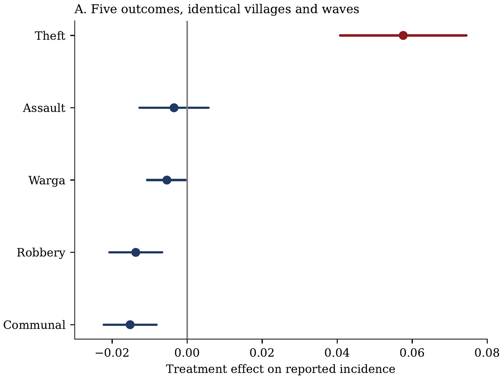
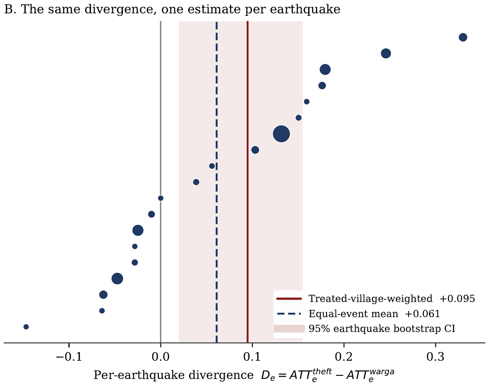

## Research interests

**Primary fields**

:::: {.grid-2}

::: {.area}

### Development Economics
Shocks, informal insurance, and household responses where formal insurance and
state capacity are weak.

:::

::: {.area}

### Public Economics
How public money is actually spent. Government procurement, the efficiency of
public purchasing, and the distance between what a rule requires and what an
official can do.

:::

::::

**Secondary fields**

:::: {.grid-2}

::: {.area}

### Political Economy
Local order, collective action, and the institutions that govern public
resources, including public procurement.

:::

::: {.area}

### Industrial Organization
Competition and bidding in government procurement markets, contract design, and
what determines whether a tender delivers value rather than only a low price.

:::

::::

::: {.area .methods}

### Methods
Causal inference on long administrative panels, and the measurement problems
that come with changing administrative boundaries.

:::

::: {.tags}

[Difference-in-Differences]{} [Instrumental Variables]{}
[Regression Discontinuity Design]{} [Spatial Econometrics]{}
[Geospatial Data Analysis]{} [Satellite & Remote Sensing Data]{}
[Administrative & Survey Microdata]{}

:::

::: {.figure}

[{fig-alt="Map of Indonesia. Villages first exposed to damage-level shaking are coloured by survey wave and scattered across the archipelago; stars mark the epicentre of the main earthquake behind each cohort."}](assets/img/fig_map_treated.png)

::: {.figcaption}

Damage-level earthquake exposure is staggered across two decades and scattered
across the archipelago, not concentrated in a single disaster. Villages are
coloured by the survey wave in which they were first exposed to MMI ≥ VI; stars
mark the epicentre of the main earthquake behind each cohort.

:::

:::

## Working papers

:::: {.paper}

::: {.paper-title}

Earthquakes and Communal Conflict: Village-Level Evidence from Indonesia

:::

::: {.paper-meta}

with M. Halley Yudhistira and Jahen F. Rezki &nbsp;·&nbsp; [Working paper]{.paper-status} &nbsp;·&nbsp; JEL: D74, K42, Q54, O12, O18, R12

:::

::: {.paper-abstract}

Do earthquakes raise or suppress communal conflict? We combine seven waves of
Indonesia's village census (PODES, 2005–2024) with village-level USGS ShakeMap
intensities in a staggered difference-in-differences design. Within Indonesia's
medium and high seismic-hazard zones, a village's first exposure to damage-level
shaking (MMI ≥ VI) lowers reported communal conflict by 1.5 percentage points
(SE 0.004) against the treated villages' 6.1 percent pre-exposure rate. That
average conceals a split we take seriously rather than relegate: among the
roughly nine in ten treated villages that had never reported an episode,
exposure instead *raises* the onset of communal conflict by 0.70 percentage
points (SE 0.22) against a counterfactual onset rate of 2.1 percent.

The finding the paper rests on is compositional. The same survey form that
records communal conflict also records theft, robbery, and assault. On a single
common sample of 211,082 village-waves, theft rises by 5.8 percentage points
against a 41 percent base while communal conflict falls, robbery falls by 1.4
points, and assault does not move. That contrast survives inference which treats
the earthquake rather than the village as the unit of assignment: estimated
event by event over 19 earthquakes, the divergence is 0.095 (bootstrap SE 0.034)
weighting earthquakes by the villages they treat, and 0.061 counting each
earthquake once (p = 0.046) — a bar the pooled level decline does not clear.

The pattern rejects a general improvement in local security. It is most
consistent with a shock that degrades a village's capacity for organised
collective action, capacity that was doing two jobs at once: supplying the
mobilisation communal violence requires, and supplying the routine guardianship
— the night-watch rotations of *siskamling* — that deters property crime.
High-involvement public-purpose *gotong royong* falls by 3.1 to 3.2 percentage
points after exposure, while emergency mutual aid, which needs no standing
coordination, does not.

:::

::: {.figure style="margin-top:1.2rem"}

[{fig-alt="Coefficient plot of the treatment effect on five outcomes. Theft alone sits well above zero; communal conflict and robbery sit below it; assault sits on it."}](assets/img/fig_composition_a.png)

[{fig-alt="Scatter of the theft-minus-communal gap for each of nineteen earthquakes, sorted by size. Most points are positive, and the pooled means and their bootstrap interval lie above zero."}](assets/img/fig_composition_b.png)

::: {.figcaption}

The composition of disorder. On a single common sample of 211,082
village-waves, theft is the only outcome that rises after damage-level shaking:
communal conflict and robbery fall, and assault does not move (Panel A, with 95
percent village-clustered intervals). *Warga* is the civilian-versus-civilian
series, the one whose survey definition holds across all seven waves. Panel B
re-estimates the theft-minus-*warga* gap separately for each of the 19 usable
earthquakes, with marker area proportional to the villages an earthquake
treats. The divergence survives when the earthquake, rather than the village, is
the unit of inference — the bar the pooled level decline does not clear.

:::

:::

::: {.paper-links}

[Draft (PDF)](files/paper1-earthquakes-communal-conflict.pdf) [This version: .]{.disabled}

:::

::::

## Work in progress

:::: {.paper}

::: {.paper-title}

Faith after the Shock: Earthquakes, Religious Expenditure, and the Insurance
Value of Religion in Indonesia

:::

::: {.paper-meta}

Billy Tulungen &nbsp;·&nbsp; [In progress]{.paper-status}

:::

::: {.paper-abstract}

Does religion function as informal insurance against uninsured risk? The
existing evidence rests largely on stated religiosity measured at district level
or on aggregate shocks. This project instead observes what households actually
pay: religious and ceremonial expenditure in rupiah, drawn from the consumption
module used for Indonesia's official poverty statistics, matched to
village-level earthquake exposure on constant 2005 boundaries. The design
separates three channels with opposing predictions — the income effect, the
club-good or mutual-insurance channel, and the coping channel — using a
within-block placebo that isolates the income effect and a continuous exposure
measure built from exact event timestamps against the survey's twelve-month
recall window.

:::

::::

## Publications

:::: {.paper}

::: {.paper-title}

Kompetisi dan Efisiensi pada Pengadaan Pemerintah: Bukti Empiris pada
Kementerian/Lembaga di Indonesia

:::

::: {.paper-meta}

with Vid Adrison &nbsp;·&nbsp; *Indonesian Treasury Review*, 6(1), 19–29, 2021

:::

::: {.paper-abstract}

Does competition make government procurement cheaper? Using more than 82,000
procurement records from Indonesian line ministries and agencies, we find that
each additional bidder lowers the winning bid by about 3.35 percent of the
official cost estimate.

:::

::: {.paper-links}

[Article](https://doi.org/10.33105/itrev.v6i1.225)

:::

::::

## Grants

::::: {.entry}

::: {.years}

2026–2027

:::

:::: {.what}

[PhD Research Grant, ReCIPE Programme]{.role}

::: {.org}

"Crack Beneath and Between: Earthquakes and Communal Conflict in Indonesia's
Seismic Zone." Centre for Economic Policy Research (CEPR) and the UK Foreign,
Commonwealth and Development Office (FCDO).

:::

::::

:::::

## Dissertation

**Shaking Land and Shaking Lives: Essays on the Economic Impacts of Seismic
Disasters**. Department of Economics, Faculty of Economics and Business,
Universitas Indonesia. Expected completion February 2028. Supervisor:
M. Halley Yudhistira, Ph.D. Co-supervisor: Jahen F. Rezki, Ph.D.

The dissertation asks how large, plausibly exogenous physical shocks propagate
through village-level social and economic life in a setting where formal
insurance is thin and local order is largely self-enforced. The chapters share a
common empirical infrastructure: a long village panel harmonised onto constant
2005 boundaries, and earthquake exposure constructed from USGS ShakeMap
intensity surfaces.

::::: {.entry}

::: {.years}

Chapter 1

:::

:::: {.what}

[Earthquakes and Communal Conflict]{.role}

::: {.org}

Village-level evidence from Indonesia, with M. Halley Yudhistira and Jahen F.
Rezki. Draft complete, under revision.

:::

::::

:::::

::::: {.entry}

::: {.years}

Chapter 2

:::

:::: {.what}

[Faith after the Shock]{.role}

::: {.org}

Earthquakes, religious expenditure, and the insurance value of religion. In progress.

:::

::::

:::::

## Data and code

I am committed to reproducible empirical work. Replication packages for the
dissertation chapters will be posted here as each paper is released: cleaning
code, analysis do-files, and the village boundary crosswalk used to harmonise
PODES waves onto constant 2005 boundaries.
